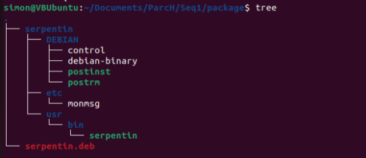

# Les paquets Linux

### Création de l’arborescence
- La racine porte le nom du package. 
- Les fichiers qui seront installés dans l’emplacement /foo/bar de la machine, doivent être créés dans une arborescence identique /foo/bar.

Exemple :
``` bash
nom_du_paquet/
 |__ DEBIAN/ 
 |        |__ control
 |        |__ postinst 
 |        |__ postrm 
 |        |__ prerm 
 |        |__ preinst 
 |__ etc 
 |      |__ mon_fichier_de_conf
 |__ usr
       |__ bin 
             |__ mon_progamme
```

### Les fichiers en détails
Le fichier ```nom_du_paquet/DEBIAN/control``` (un saut de ligne est nécessaire en fin de fichier) :
```
Package: mon_du_paquet
Version: 1.0
Section: misc
Priority: optional
Architecture: all
Depends: bash
Maintainer: Simon Pieto
Description: Affiche le  message dans /etc/mon_fichier_de_conf
```

Le script ```nom_du_paquet/DEBIAN/postinst``` (nécessite les droits d’exécution) : 
```bash
#!/bin/bash

echo "Installation réussie !! "
```

Le script ```nom_du_paquet/DEBIAN/postrm``` (nécessite les droits d’exécution) :
```bashs
#!/bin/bash

echo "Au revoir :("
```

Le fichier ```nom_du_paquet/etc/mon_fichier_de_conf``` :
```
Les serpentins sont des ZINZINS
```

Le programme ```nom_du_paquet/usr/bin/mon_progamme``` :
```bash
#!/bin/bash

cat /etc/mon_fichier_de_conf
```

Pour les droits sur les fichiers :
```bash
sudo chmod 755 post*
sudo chmod 755 pre* 
```

### Installation du paquet
```bash
dpkg-deb --build nom_du_paquet
# Un paquet .deb est généré 

# Pour observer l'intérieur du paquet
dpkg-deb --contents nom_du_paquet.deb 
# Pour obtenir des informations sur le paquet 
dpkg-deb -I nom_du_paquet.deb

# Installation du paquet 
sudo dpkg -i nom_du_paquet.deb 

# Observer la version du paquet une fois installé 
nom_du_paquet -v 

# Pour désintaller le paquet 
sudo dpkg -r nom_du_paquet
```

### Exemple 

Commande à taper pour installer le paquet serpentin :
```bash
dpkg-deb --build serpentin
sudo dpkg -i serpentin.deb
```

Résultat de la commande tree a l'endroit ou je me trouve :


Dans ```serpentin/usr/bin``` on trouve un fichier exécutable ```serpentin``` qui est un script bash qui execute la commande```cat /etc/monmsg```

Après installation si on tape dans l’invite de commande : 
```bash
serpentin
```
On obtient le résultat suivant :
```bash
Les serpentin sont des ZINZINS
```


